# Modelo de datos — SITRAM

> Diseño lógico y físico de la base de datos (PostgreSQL/Supabase + EF Core 10, ver
> [ADR-0007](decisiones/ADR-0007-migracion-postgresql-supabase.md)). Consistente con
> los agregados de [arquitectura.md](arquitectura.md), la clasificación de seguridad de
> [ADR-0004](decisiones/ADR-0004-seguridad-proteccion-datos.md) y los
> [requisitos](requisitos.md). Alimenta el Anexo "Diagrama Entidad-Relación (DER)" del informe.

## 1. Diagrama Entidad-Relación

```mermaid
erDiagram
    CIUDADANO ||--o{ TRAMITE : "inicia"
    CIUDADANO ||--o{ CONSENTIMIENTO : "otorga"
    USUARIO   ||--o{ USUARIO_ROL : "tiene"
    ROL       ||--o{ USUARIO_ROL : "asignado"
    ROL       ||--o{ ROL_PERMISO : "agrupa"
    PERMISO   ||--o{ ROL_PERMISO : "incluido"
    CIUDADANO ||--|| USUARIO : "es"
    TIPO_TRAMITE ||--o{ TRAMITE : "clasifica"
    TIPO_TRAMITE ||--o{ REQUISITO_DOCUMENTO : "exige"
    TIPO_TRAMITE ||--o{ PASO_FLUJO : "define"
    TRAMITE   ||--o{ DOCUMENTO : "contiene"
    TRAMITE   ||--o{ PAGO : "genera"
    TRAMITE   ||--o{ ACTUACION : "registra"
    TRAMITE   ||--o| RESOLUCION : "resuelve"
    TRAMITE   ||--o{ EVENTO_AUDITORIA : "audita"
    USUARIO   ||--o{ EVENTO_AUDITORIA : "ejecuta"
    USUARIO   ||--o{ INCIDENTE_SEGURIDAD : "reporta"

    CIUDADANO {
        uniqueidentifier CiudadanoId PK
        nvarchar Nombres
        nvarchar Apellidos
        varbinary Dni "cifrado (determinista)"
        varbinary Telefono "cifrado"
        varbinary Correo "cifrado (determinista)"
        nvarchar Direccion
        bit EstaAnonimizado "derecho al olvido"
        datetime2 CreadoUtc
    }
    USUARIO {
        uniqueidentifier UsuarioId PK
        nvarchar UserName
        nvarchar PasswordHash "bcrypt/PBKDF2"
        bit MfaHabilitado
        int IntentosFallidos
        bit Bloqueado
        datetime2 CreadoUtc
    }
    ROL {
        int RolId PK
        nvarchar Nombre
    }
    PERMISO {
        int PermisoId PK
        nvarchar Codigo "ej. tramite:aprobar"
    }
    USUARIO_ROL {
        uniqueidentifier UsuarioId FK
        int RolId FK
    }
    ROL_PERMISO {
        int RolId FK
        int PermisoId FK
    }
    TIPO_TRAMITE {
        int TipoTramiteId PK
        nvarchar Nombre
        nvarchar Descripcion
        nvarchar AreaResponsable
        decimal Tasa
        bit Activo "borrado lógico"
    }
    REQUISITO_DOCUMENTO {
        int RequisitoId PK
        int TipoTramiteId FK
        nvarchar Nombre
        bit Obligatorio
    }
    PASO_FLUJO {
        int PasoId PK
        int TipoTramiteId FK
        int Orden
        int RolResponsableId FK
    }
    TRAMITE {
        uniqueidentifier TramiteId PK
        uniqueidentifier CiudadanoId FK
        int TipoTramiteId FK
        nvarchar Estado "máquina de estados"
        nvarchar Codigo "correlativo público"
        datetime2 CreadoUtc
        rowversion RowVersion "concurrencia optimista"
    }
    DOCUMENTO {
        uniqueidentifier DocumentoId PK
        uniqueidentifier TramiteId FK
        nvarchar NombreArchivo
        nvarchar RutaAlmacenamiento
        nvarchar HashSha256 "integridad"
        datetime2 SubidoUtc
    }
    PAGO {
        uniqueidentifier PagoId PK
        uniqueidentifier TramiteId FK
        decimal Monto
        nvarchar Estado "Pendiente/Confirmado/Fallido"
        nvarchar ReferenciaPasarela
        datetime2 FechaUtc
    }
    ACTUACION {
        uniqueidentifier ActuacionId PK
        uniqueidentifier TramiteId FK
        nvarchar EstadoAnterior
        nvarchar EstadoNuevo
        nvarchar Comentario
        datetime2 FechaUtc
    }
    RESOLUCION {
        uniqueidentifier ResolucionId PK
        uniqueidentifier TramiteId FK
        nvarchar Sentido "Aprobado/Rechazado"
        nvarchar RutaDocumento
        datetime2 EmitidaUtc
    }
    CONSENTIMIENTO {
        uniqueidentifier ConsentimientoId PK
        uniqueidentifier CiudadanoId FK
        nvarchar Finalidad
        bit Otorgado
        datetime2 FechaUtc
        datetime2 RevocadoUtc
    }
    EVENTO_AUDITORIA {
        bigint EventoId PK
        uniqueidentifier TramiteId FK
        uniqueidentifier UsuarioId FK
        nvarchar Accion
        nvarchar DatosAntes "JSON, sin PII"
        nvarchar DatosDespues "JSON, sin PII"
        nvarchar DireccionIp
        datetime2 FechaUtc
    }
    INCIDENTE_SEGURIDAD {
        uniqueidentifier IncidenteId PK
        nvarchar Descripcion
        nvarchar Severidad
        datetime2 DetectadoUtc
        datetime2 NotificadoUtc
        uniqueidentifier ReportadoPorId FK
    }
```

## 2. Descripción de las entidades

| Entidad | Propósito | Requisitos |
|---------|-----------|-----------|
| `CIUDADANO` | Titular de datos; datos personales cifrados a nivel columna | RF-001, RF-060…RF-064 |
| `USUARIO` | Credenciales y estado de acceso (Identity) | RF-002…RF-006 |
| `ROL`, `PERMISO`, `USUARIO_ROL`, `ROL_PERMISO` | RBAC configurable (rol → permisos) | ADR-0005, RF-006 |
| `TIPO_TRAMITE` | Plantilla del TUPA (tasa, área, activo) | RF-010…RF-014 |
| `REQUISITO_DOCUMENTO` | Documentos exigidos por tipo de trámite | RF-011 |
| `PASO_FLUJO` | Definición del flujo de aprobación por tipo | RF-012 |
| `TRAMITE` | **Agregado raíz**: expediente con estado y concurrencia | RF-020…RF-030 |
| `DOCUMENTO` | Archivos adjuntos con hash de integridad | RF-021 |
| `PAGO` | Pago de tasa, transaccional con el cambio de estado | RF-040…RF-044 |
| `ACTUACION` | Historial de transiciones de estado del expediente | RF-052 |
| `RESOLUCION` | Acto final (aprueba/rechaza) y documento resultante | RF-028, RF-030 |
| `CONSENTIMIENTO` | Registro de consentimiento y su revocación | RF-063, RF-064 |
| `EVENTO_AUDITORIA` | Registro **inmutable** de cada acción (append-only) | RF-070…RF-073 |
| `INCIDENTE_SEGURIDAD` | Registro y notificación de brechas (D.S. 016-2024-JUS) | RF-065 |

## 3. Clasificación y cifrado de datos

Según la política de [ADR-0004](decisiones/ADR-0004-seguridad-proteccion-datos.md):

| Columna | Clasificación | Protección |
|---------|---------------|-----------|
| `CIUDADANO.Dni` | Personal | AES-256 app-level **determinista** (permite búsqueda por igualdad) |
| `CIUDADANO.Correo` | Personal | AES-256 app-level **determinista** |
| `CIUDADANO.Telefono` | Personal | AES-256 app-level **aleatorio** |
| `CIUDADANO.Direccion` | Personal | Cifrado en reposo (nivel proveedor) |
| `USUARIO.PasswordHash` | Secreto | Hash bcrypt/PBKDF2 (nunca cifrado reversible) |
| Toda la base | — | Cifrado en reposo de los volúmenes (Supabase) |
| `EVENTO_AUDITORIA.DatosAntes/Despues` | Interno | JSON **sin PII** (datos personales enmascarados) |

> Regla: no se cifran con cifrado aleatorio las columnas que requieren `LIKE`/orden; para
> búsqueda por igualdad (DNI, correo) se usa cifrado determinista. Ver
> [errores conocidos 3.2](errores-conocidos.md).

## 4. Índices y rendimiento

| Índice | Tabla / columnas | Motivo (RNF-020, RNF-021) |
|--------|------------------|---------------------------|
| PK clustered | cada tabla por su `Id` | Acceso primario |
| `IX_Tramite_Ciudadano` | `TRAMITE(CiudadanoId)` | Listar trámites del ciudadano (RF-050) |
| `IX_Tramite_Estado` | `TRAMITE(Estado)` | Bandejas de funcionarios y reportes (RF-072) |
| `UQ_Tramite_Codigo` | `TRAMITE(Codigo)` único | Código público correlativo |
| `IX_Auditoria_Fecha` | `EVENTO_AUDITORIA(FechaUtc)` | Consulta/filtrado de auditoría (RF-071) |
| `IX_Pago_Tramite` | `PAGO(TramiteId)` | Verificar pago antes de avanzar (RF-043) |

- La tabla `EVENTO_AUDITORIA` puede **particionarse por fecha** para no degradar el sistema
  al crecer (RNF-021).

## 5. Reglas de integridad y diseño

- **Claves**: `uuid` (GUID) en agregados para evitar exponer correlativos y facilitar
  generación distribuida; `integer` en catálogos (roles, permisos, tipos).
- **Concurrencia optimista**: columna de sistema `xmin` de Postgres en `TRAMITE` → evita
  doble aprobación (antes `rowversion` de SQL Server, ver
  [ADR-0007](decisiones/ADR-0007-migracion-postgresql-supabase.md) y
  [errores conocidos 1.1](errores-conocidos.md)).
- **Borrado lógico**: `TIPO_TRAMITE.Activo` y `CIUDADANO.EstaAnonimizado`; **nunca** se borran
  trámites (obligación de archivo municipal). El derecho al olvido **anonimiza**, no elimina el
  expediente (RF-062).
- **Fechas en UTC** (`timestamp`, sufijo `Utc`) — [errores conocidos 2.4](errores-conocidos.md).
- **Auditoría append-only**: sin `UPDATE`/`DELETE` desde la aplicación; se refuerza con
  permisos del motor (RF-073).
- **Transacción pago + estado**: `PAGO.Estado = Confirmado` y la transición del `TRAMITE`
  ocurren en la **misma transacción** (RNF-032).

## 6. Mapeo a EF Core (Infrastructure)

- Cada entidad tiene una clase de configuración `IEntityTypeConfiguration<T>` en
  `Sitram.Infrastructure/Persistence/Configurations/`.
- Los **Value Objects** del dominio (`Dni`, `Dinero`) se mapean con *conversions* o
  *owned types*.
- El esquema se versiona con **migraciones EF Core**; una migración por PR
  ([flujo de trabajo](flujo-de-trabajo.md)).
- Datos semilla (roles, permisos, tipos de trámite base) se cargan con `HasData` o un
  *seeder* idempotente.
