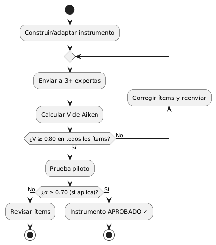

# Validación y confiabilidad de los instrumentos — SITRAM

> La credibilidad de los resultados depende de que los instrumentos de medición sean
> **válidos** (miden lo que dicen medir) y **confiables** (miden de forma consistente). Este
> documento define cómo se **valida y acepta** cada instrumento antes de aplicarlo. Alimenta
> el Capítulo III (Material y Métodos) y los Anexos (formatos de validación).

## 1. Marco de validación

Todo instrumento se somete a dos pruebas antes de considerarse apto:

| Propiedad | Qué garantiza | Método | Criterio de aceptación |
|-----------|---------------|--------|------------------------|
| **Validez de contenido** | Que los ítems representan lo que se quiere medir | **Juicio de expertos** cuantificado con **Coeficiente V de Aiken** | **V ≥ 0.80** por ítem y global |
| **Confiabilidad** | Consistencia de la medición | **Alfa de Cronbach** sobre prueba piloto (para escalas tipo Likert) | **α ≥ 0.70** |

> Referencias metodológicas: Hernández-Sampieri et al. (2014); Aiken (1985); Cronbach (1951).

## 2. Panel de expertos (juicio de expertos)

- **Cantidad**: mínimo **3 expertos** (recomendado 3–5).
- **Perfil**: docentes/profesionales con grado de magíster o doctor en **Ingeniería de
  Software**, **Seguridad de la Información** o **Protección de Datos**.
- **Procedimiento**: cada experto recibe la matriz de consistencia, el instrumento y una
  **ficha de validación** donde califica cada ítem en tres criterios: **claridad**,
  **coherencia** y **relevancia** (escala 1–4 o "Sí/No").
- **Resultado**: se calcula la **V de Aiken** por ítem; los ítems con V < 0.80 se **corrigen
  o eliminan**. Se adjunta la **constancia de validación** firmada por cada experto (Anexo).

### Fórmula V de Aiken

```
        S
V = ───────────
    n · (c − 1)

S = sumatoria de las valoraciones asignadas por los jueces
n = número de jueces
c = número de valores de la escala
```

## 3. Instrumentos del proyecto y su validación

### 3.1 Cuestionario de Usabilidad (Escala SUS) — variable X4

- **Naturaleza**: instrumento **estandarizado y validado internacionalmente** (Brooke, 1996);
  10 ítems en escala Likert de 5 puntos. Su confiabilidad reportada en la literatura es
  **α ≈ 0.91**.
- **Validación en este proyecto**:
  - Al ser un instrumento ya validado, se valida únicamente la **adaptación/traducción al
    español** mediante juicio de expertos (V de Aiken).
  - Se calcula el **Alfa de Cronbach** sobre la muestra piloto para confirmar la confiabilidad
    en el contexto local.
- **Aceptación**: V ≥ 0.80 en la adaptación y α ≥ 0.70 en la aplicación.

### 3.2 Checklist de Seguridad y Protección de Datos — variable X3

- **Naturaleza**: instrumento **construido** para este proyecto (lista de verificación
  dicotómica: Cumple / No cumple / No aplica).
- **Base normativa y técnica** (da validez de contenido de origen):
  - **OWASP ASVS** (Application Security Verification Standard) — controles técnicos.
  - **OWASP Top 10** — riesgos priorizados.
  - **Ley N.° 29733** y su reglamento **D.S. N.° 016-2024-JUS** — obligaciones legales
    (consentimiento, ARCO, portabilidad, cifrado, notificación de incidentes, oficial de datos).
- **Validación en este proyecto**: **juicio de expertos** en seguridad/protección de datos
  (V de Aiken ≥ 0.80). No requiere Alfa de Cronbach por no ser una escala de percepción, sino
  una verificación objetiva de cumplimiento.
- **Trazabilidad**: cada ítem del checklist se enlaza a un requisito RNF y a un artículo legal
  o control OWASP, lo que refuerza su validez.

### 3.3 Ficha de Análisis Documental — variable X1 y X2

- **Naturaleza**: instrumento **construido** para registrar objetivamente los entregables de
  ingeniería (requisitos, diagramas, ADR, módulos, cobertura) y la operatividad de los
  módulos críticos.
- **Validación**: **juicio de expertos** en ingeniería de software (V de Aiken ≥ 0.80).
- **Aceptación**: al ser registro objetivo (existe/no existe, funciona/no funciona), la
  confiabilidad se asegura con **criterios de registro claros** y, opcionalmente,
  **acuerdo entre observadores** (dos evaluadores → índice de concordancia).

## 4. Resumen: qué validación aplica a cada instrumento

| Instrumento | Variable | Validez de contenido | Confiabilidad | ¿Requiere expertos? |
|-------------|----------|----------------------|---------------|---------------------|
| Cuestionario SUS | X4 Usabilidad | V de Aiken (adaptación) | Alfa de Cronbach | Sí (adaptación) |
| Checklist Seguridad/Datos | X3 Seguridad | V de Aiken | Concordancia (opcional) | Sí |
| Ficha de Análisis Documental | X1, X2 | V de Aiken | Acuerdo observadores (opcional) | Sí |

## 5. Evidencias que se adjuntan como Anexos

1. **Formato de validación por juicio de expertos** (ficha que llena cada juez).
2. **Constancias de validación** firmadas por los expertos.
3. **Cálculo de la V de Aiken** por instrumento (tabla).
4. **Cálculo del Alfa de Cronbach** del SUS (prueba piloto).
5. **Instrumentos finales** ya corregidos y aprobados.

## 6. Flujo de aceptación de un instrumento

**Figura 13**

*Flujo de aceptación de un instrumento de medición*



*Nota.* Elaboración propia.

Solo un instrumento **aprobado** (V ≥ 0.80 y, si aplica, α ≥ 0.70) se usa para recolectar los
datos que sustentan los resultados del Capítulo IV.
