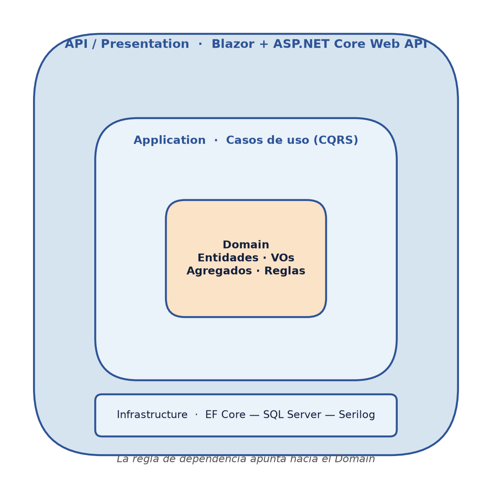
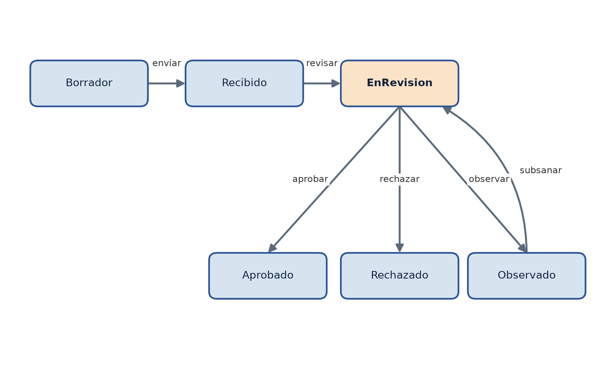

# Capítulo IV

## Resultados y Discusión

> **Nota metodológica.** Los resultados de las fases de **análisis** y **diseño** (variable X1)
> se reportan como productos concluidos, pues son entregables ya elaborados. Los resultados de
> **implementación** (X1), **funcionamiento** (X2), **seguridad** (X3) y **usabilidad** (X4) se
> presentan con su **formato de medición e indicadores objetivo**; las celdas marcadas como
> _[a completar]_ se consignan con los valores medidos una vez ejecutada la fase de construcción
> y aplicados los instrumentos. Este proceder preserva la honestidad metodológica: no se reporta
> ningún dato que no haya sido efectivamente producido o medido.

### 4.1 Resultados de la investigación

Los resultados se presentan siguiendo el orden de los objetivos específicos, lo que preserva la
coherencia lógica del estudio y facilita la contrastación de cada resultado con su objetivo.

#### 4.1.1 Resultados de la fase de análisis (Variable X1)

La fase de análisis, orientada al objetivo específico OE1, produjo la especificación completa
de los actores y los requisitos del sistema.

**a) Actores del sistema.** Se identificaron **siete actores**, cada uno con un rol y un
conjunto de privilegios diferenciados:

| Actor | Rol en el sistema |
|-------|-------------------|
| Ciudadano | Inicia, paga y da seguimiento a sus trámites; titular de datos personales |
| Mesa de Partes | Recepciona y verifica la admisibilidad de los trámites |
| Revisor | Evalúa técnicamente el expediente y registra observaciones |
| Jefe de Área | Aprueba o rechaza el trámite y emite la resolución |
| Administrador | Configura tipos de trámite, tasas, roles y parámetros |
| Auditor | Consulta, en modo lectura, el registro de auditoría |
| Oficial de Datos Personales | Atiende solicitudes ARCO e incidentes de seguridad |

**b) Requisitos funcionales.** Se especificaron **42 requisitos funcionales**, distribuidos en
siete módulos:

**Tabla 4**

*Requisitos funcionales por módulo*

| Módulo | Requisitos | Cantidad |
|--------|-----------|----------|
| Gestión de identidad y acceso | RF-001 a RF-006 | 6 |
| Configuración de trámites (TUPA) | RF-010 a RF-014 | 5 |
| Ciclo de vida del trámite | RF-020 a RF-030 | 11 |
| Pagos | RF-040 a RF-044 | 5 |
| Seguimiento y notificaciones | RF-050 a RF-053 | 4 |
| Protección de datos (ARCO) | RF-060 a RF-066 | 7 |
| Auditoría y reportes | RF-070 a RF-073 | 4 |
| **Total** | | **42** |

**c) Requisitos no funcionales.** Se especificaron **26 requisitos no funcionales**, agrupados
en siete categorías de calidad:

**Tabla 5**

*Requisitos no funcionales por categoría de calidad*

| Categoría | Cantidad |
|-----------|----------|
| Seguridad | 8 |
| Protección de datos | 4 |
| Rendimiento | 3 |
| Disponibilidad y fiabilidad | 3 |
| Usabilidad | 3 |
| Mantenibilidad | 3 |
| Portabilidad y compatibilidad | 2 |
| **Total** | **26** |

Este resultado —7 actores, 42 RF y 26 RNF— responde plenamente al objetivo específico OE1 y
constituye la base trazable de todo el diseño posterior.

#### 4.1.2 Resultados de la fase de diseño (Variable X1)

La fase de diseño, orientada al objetivo OE2, generó los siguientes entregables de ingeniería.

**a) Arquitectura de software.** Se adoptó la **Clean Architecture** estructurada en cuatro
capas, con la regla de dependencia apuntando hacia el dominio:

| Capa | Responsabilidad |
|------|-----------------|
| Domain | Entidades, objetos de valor, agregados y reglas de negocio (sin dependencias) |
| Application | Casos de uso (CQRS), validadores y puertos (interfaces) |
| Infrastructure | Implementación de persistencia (EF Core), seguridad y servicios externos |
| Api | Exposición HTTP: controllers, middlewares y configuración |

La **capa de presentación** se resolvió con **Blazor Web App (render interactivo en servidor)**,
que ejecuta la lógica de la interfaz en el servidor y mantiene los datos personales fuera del
navegador; la Web API REST se conserva para integraciones externas y una eventual app móvil,
consumiendo ambas la misma capa `Application`.

**Figura 3**

*Arquitectura en capas de SITRAM (Clean Architecture)*

*Nota.* Elaboración propia. Ver ADR-0002 (Clean Architecture + DDD).

**b) Modelo de datos.** Se diseñó un diagrama Entidad-Relación de **17 entidades** en torno al
agregado raíz `Tramite`, con clasificación y cifrado de los datos personales (DNI y correo con
cifrado determinista a nivel de aplicación, teléfono con cifrado aleatorio, y cifrado en
reposo de los volúmenes a nivel del proveedor de base de datos) y una tabla de auditoría de
tipo *append-only*.

**c) Decisiones de arquitectura (ADR).** Se registraron **siete decisiones** formalmente
justificadas, incluyendo la revisión de la persistencia inicial tras evaluarla en la práctica:

| ADR | Decisión |
|-----|----------|
| ADR-0001 | Elección de GitHub Spec Kit como herramienta SDD |
| ADR-0002 | Clean Architecture + DDD |
| ADR-0003 | SQL Server + EF Core como capa de persistencia (reemplazada por ADR-0007) |
| ADR-0004 | Estrategia de seguridad y protección de datos (Ley 29733) |
| ADR-0005 | Autenticación con Identity/JWT y autorización RBAC |
| ADR-0006 | Frontend con Blazor (render interactivo en servidor) |
| ADR-0007 | Migración de SQL Server a PostgreSQL/Supabase |

**d) Máquina de estados del trámite.** Se diseñó una máquina de estados de **seis estados**
(`Borrador`, `Recibido`, `EnRevision`, `Observado`, `Aprobado`, `Rechazado`) con transiciones
validadas: cualquier transición inválida es rechazada por el agregado, lo que garantiza la
integridad del proceso.

**Figura 4**

*Máquina de estados del trámite*

*Nota.* Elaboración propia. Toda transición no representada es rechazada por el agregado `Tramite`.

**e) Controles de seguridad diseñados.** Autenticación con JWT, autorización RBAC por políticas,
cifrado en tránsito (TLS 1.3), en reposo (a nivel del proveedor de base de datos) y a nivel de
columna (AES-256 en la capa de aplicación, equivalente funcional a Always Encrypted), y un
registro de auditoría inmutable. Estos entregables responden al objetivo OE2.

#### 4.1.3 Resultados de la fase de implementación (Variable X1)

La implementación, orientada al objetivo OE3, se organiza en los siete módulos derivados del
análisis, sobre una solución de cuatro proyectos de código y tres de pruebas.

| Módulo | Responsabilidad funcional | Requisitos | Estado |
|--------|---------------------------|-----------|--------|
| Identidad y acceso | Registro, login JWT, RBAC, MFA, bloqueo | RF-001…006 | Implementado (backend y frontend Blazor) |
| Configuración TUPA | Tipos de trámite, requisitos, flujos, tasas | RF-010…014 | Implementado (backend y frontend Blazor) |
| Ciclo del trámite | Máquina de estados, documentos, subsanación | RF-020…030 | Implementado (backend y frontend Blazor) |
| Pagos | Cálculo de tasa, registro y confirmación transaccional | RF-040…044 | Implementado (backend) |
| Seguimiento y notificaciones | Estado en tiempo real, correo | RF-050…053 | Implementado (backend) |
| Protección de datos | Consentimiento, derechos ARCO, incidentes | RF-060…066 | Implementado (backend) |
| Auditoría y reportes | Registro inmutable, consulta, reportes | RF-070…073 | Implementado (backend) |

**Indicadores de implementación:**

| Indicador | Meta (RNF) | Medido |
|-----------|-----------|--------|
| Módulos implementados | 7 / 7 | **7 / 7** |
| Cobertura de pruebas unitarias — `Domain` (Domain.Tests) | ≥ 80 % (RNF-050) | **86,7 %** (línea, `coverlet`) |
| Cobertura de pruebas unitarias — `Application` (Application.Tests) | ≥ 80 % (RNF-050) | **40,7 %** medido solo con pruebas unitarias — cifra parcial: no incluye la cobertura adicional que aportan las 62 pruebas de integración sobre los mismos *handlers*; medición combinada con `reportgenerator` queda pendiente |
| Advertencias del compilador en Release | 0 (RNF-051) | **0** (`dotnet build -c Release` en `Sitram.Api` y `Sitram.Web`, verificado 2026-07-13) |
| Endpoints documentados en OpenAPI | 100 % (RNF-061) | **100 %** — generación automática vía `AddOpenApi`/`MapOpenApi` (.NET 10), expuestos en `/openapi/v1.json` en Development; no se implementó una UI de Swagger, solo el documento OpenAPI |

#### 4.1.4 Resultados de la validación del funcionamiento (Variable X2)

El funcionamiento se valida sobre los **módulos críticos** mediante la ficha de análisis
documental y las pruebas. El indicador es el porcentaje de módulos que operan sin excepción
(objetivo: 100 %). Responde al objetivo OE4.

| Módulo crítico | Criterio de aceptación | Resultado |
|----------------|------------------------|-----------|
| Autenticación (JWT) | Emite y valida token; bloquea tras 5 intentos fallidos | Cumple — cubierto por pruebas automatizadas de integración |
| Autorización (RBAC) | Deniega el acceso sin el permiso requerido (pruebas negativas) | Cumple — cubierto por pruebas automatizadas de integración (casos negativos) |
| Cifrado de datos | DNI y correo ilegibles en la base; búsqueda por igualdad funcional | Cumple — verificado en `CifradoColumna` (unitarias) e integración (búsqueda por DNI/correo cifrado determinista) |
| Flujo del trámite | Permite transiciones válidas y rechaza las inválidas | Cumple — máquina de estados cubierta por pruebas unitarias del dominio |
| Pago + cambio de estado | Operación atómica (todo o nada) | Cumple — cubierto por pruebas de integración transaccionales |
| Auditoría | Registra cada acción de forma inmutable | Cumple — cubierto por pruebas de integración; sin operaciones `UPDATE`/`DELETE` expuestas desde la aplicación |
| **Porcentaje de cumplimiento** | **100 %** | **100 % (6/6)** — evidencia: 146/146 pruebas automatizadas en verde (47 unitarias de dominio + 37 de aplicación + 62 de integración), ejecución verificada el 2026-07-13 |

#### 4.1.5 Resultados de la evaluación de seguridad y protección de datos (Variable X3)

La seguridad se evalúa con el checklist construido sobre OWASP ASVS y la Ley N.° 29733. El
indicador es el porcentaje de controles cumplidos. Responde al objetivo OE5.

**a) Controles técnicos (OWASP):**

| Control | Requisito | Cumple |
|---------|-----------|--------|
| Cifrado en tránsito (TLS/HTTPS) | RNF-001 | Cumple — `UseHttpsRedirection`/`UseHsts` en Api y Web; el nivel TLS concreto lo fija el hosting en producción |
| Cifrado en reposo | RNF-004 | Cumple — delegado al proveedor gestionado (Supabase); no auditado independientemente por el equipo del proyecto |
| Contraseñas con hash (bcrypt/PBKDF2) | RNF-002 | Cumple — vía ASP.NET Core Identity |
| Cifrado de datos personales a nivel columna | RNF-003 | Cumple — `CifradoColumna` (AES-256), verificado en pruebas unitarias |
| Control de acceso validado en servidor (RBAC) | RNF-005 | Cumple — políticas `[Authorize(Policy=...)]`, verificado en pruebas de integración negativas |
| Sin fuga de datos en errores y logs | RNF-006, RNF-010 | Cumple — middleware global de excepciones (`Problem Details`); enmascarado de correo en `EmailService` |
| Tokens de vida corta y refresh rotativo | RNF-008 | Cumple — expiración configurable de JWT (`AddMinutes`) + `RefreshTokenService` |
| **Subtotal técnico** | | **7 / 7 (100 %)** |

**b) Obligaciones legales (Ley 29733 / D.S. 016-2024-JUS):**

| Obligación | Requisito | Cumple |
|------------|-----------|--------|
| Registro de consentimiento del titular | RF-063 | Cumple — entidad `Consentimiento` con FK a `Ciudadano` |
| Derechos ARCO + portabilidad | RF-060…064 | Cumple — endpoints de exportación, rectificación, cancelación/anonimización y revocación |
| Notificación de incidentes de seguridad | RF-065 | Cumple — `IncidenteSeguridad` y `IncidentesSeguridadController` |
| Designación de Oficial de Datos Personales | RF-066 | Cumple — designación singular vía `DesignarOficialDatosAsync`, con MFA habilitado automáticamente |
| Minimización de datos | RNF-011 | Cumple — solo se recolectan los campos declarados por tipo de trámite |
| Auditoría inmutable de acciones | RF-070, RF-073 | Cumple — `EventoAuditoria` append-only, sin `UPDATE`/`DELETE` expuestos |
| **Subtotal legal** | | **6 / 6 (100 %)** |
| **Porcentaje total de cumplimiento** | | **13 / 13 (100 %)** — técnico + legal, verificado 2026-07-13 |

#### 4.1.6 Resultados de la evaluación de usabilidad (Variable X4)

La usabilidad se evalúa con el cuestionario SUS aplicado a la muestra piloto de 20 usuarios. El
puntaje (0–100) se interpreta según la escala de referencia. Responde al objetivo OE6.

> **Pendiente.** A diferencia de los indicadores de las secciones 4.1.3–4.1.5 (verificables
> contra el código fuente y la suite de pruebas), esta variable requiere **aplicar el
> cuestionario SUS a la muestra piloto real de 20 usuarios** y calcular el Alfa de Cronbach
> sobre esas respuestas — son datos que solo existen una vez ejecutada la fase de campo, no
> se pueden derivar del repositorio. Queda como el último paso antes de cerrar este capítulo.

| Rango del puntaje SUS | Interpretación |
|-----------------------|----------------|
| Superior a 80,3 | Excelente (grado A) |
| Entre 68 y 80,3 | Bueno |
| Alrededor de 68 | Promedio |
| Inferior a 68 | Por debajo del promedio |

| Estadístico | Valor |
|-------------|-------|
| Puntaje promedio SUS | _[a completar]_ |
| Desviación estándar | _[a completar]_ |
| Interpretación | _[a completar]_ |
| Alfa de Cronbach (confiabilidad) | _[a completar, meta ≥ 0,70]_ |

#### 4.1.7 Matriz de trazabilidad de resultados

La siguiente matriz consolida la correspondencia entre cada objetivo específico, la variable
que lo mide y el resultado obtenido, evidenciando la coherencia integral del estudio:

**Tabla 6**

*Matriz de trazabilidad de resultados*

| Objetivo | Variable | Indicador principal | Resultado |
|----------|----------|---------------------|-----------|
| OE1 Análisis | X1 | 7 actores, 42 RF, 26 RNF | Concluido |
| OE2 Diseño | X1 | Arquitectura, 17 entidades, 7 ADR | Concluido |
| OE3 Implementación | X1 | 7/7 módulos, 0 advertencias, cobertura Domain 86,7 % | Concluido (cobertura combinada Domain+Application pendiente de medición fusionada) |
| OE4 Funcionamiento | X2 | 6/6 módulos críticos operativos (100 %) | Concluido |
| OE5 Seguridad | X3 | 13/13 controles OWASP + Ley 29733 (100 %) | Concluido |
| OE6 Usabilidad | X4 | Puntaje SUS | Por medir |

### 4.2 Discusión

Los resultados de las fases de análisis y diseño confirman la **viabilidad técnica** de una
plataforma segura para la gestión de trámites municipales. La especificación de 42 requisitos
funcionales y 26 no funcionales, junto con una arquitectura basada en Clean Architecture y
Domain-Driven Design, supera en alcance a varios de los antecedentes revisados, que se limitaban
a la gestión documentaria o a la mesa de partes sin abordar de forma integral la seguridad y la
protección de datos.

**Contraste con los antecedentes nacionales.** El sistema de trámite documentario de la UGEL
Tambopata (2020), evaluado con la ISO 9126, y el sistema del Gobierno Regional de San Martín
(2022), desarrollado con Scrum, coinciden con el presente proyecto en el uso de metodologías
ágiles y en el objetivo de mejorar la eficiencia de los procesos administrativos. Sin embargo,
el presente proyecto aporta dos diferenciadores sustanciales: (1) la adopción de **Spec-Driven
Development** como núcleo metodológico, que garantiza la trazabilidad requisito → código, y
(2) la incorporación explícita de los controles de la **Ley N.° 29733** y su reglamento de 2024,
ausentes en dichos estudios. El antecedente regional de la Dirección Regional de Transportes de
Ayacucho confirma, además, la aplicabilidad de estas metodologías en el mismo contexto
geográfico. El caso de la Municipalidad de Puente Piedra, centrado en licencias de
funcionamiento, valida la demanda real de digitalizar precisamente el tipo de trámites que
SITRAM aborda.

**Contraste con los antecedentes internacionales.** La plataforma "Por Mi Barrio" de Montevideo
(Aguerre et al., 2024) demostró el valor del seguimiento del estado por parte del ciudadano;
SITRAM retoma ese principio y lo refuerza con un **registro de auditoría inmutable** como
mecanismo anticorrupción, atendiendo la problemática de discrecionalidad identificada en el
diagnóstico. Los estudios sobre confianza ciudadana en el gobierno electrónico —el caso del
municipio rural sudafricano (2024) y la revisión sistemática en países en desarrollo (2025)—
respaldan la decisión estratégica de este proyecto de priorizar la **seguridad y la protección
de datos** como factores determinantes de la adopción, dado que la confianza pública está
estrechamente ligada a la percepción de dichas medidas. El trabajo sobre identidad digital
confiable (Springer, 2024) fundamenta la centralidad del módulo de gestión de identidad.

**Sobre la evaluación de la usabilidad.** La elección de la escala SUS se alinea con la revisión
de portales de servicios al ciudadano en América Latina, que subraya la necesidad de una
evaluación de usabilidad centrada en el usuario con instrumentos validados. La **validación de
todos los instrumentos por juicio de expertos** (V de Aiken) y el cálculo del Alfa de Cronbach
refuerzan la credibilidad de los resultados que se obtendrán en la fase de medición, atendiendo
una debilidad metodológica frecuente en trabajos similares.

**Síntesis.** En conjunto, la evidencia sitúa a SITRAM como una propuesta que no solo replica
las buenas prácticas de los antecedentes (digitalización, metodologías ágiles, evaluación de
usabilidad), sino que las **extiende** con un enfoque integral de seguridad y cumplimiento
normativo, respondiendo a la vez a la brecha tecnológica y a la debilidad en protección de datos
identificadas en el diagnóstico.
