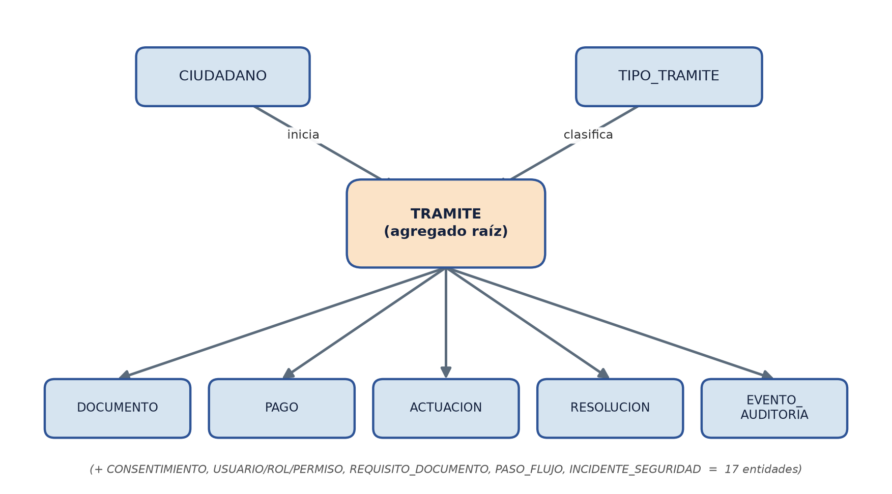
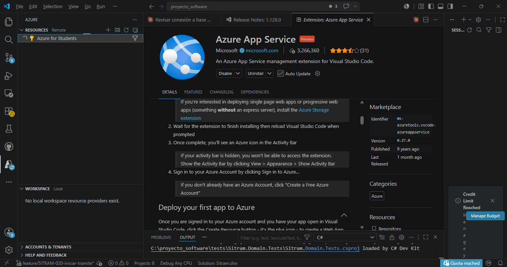
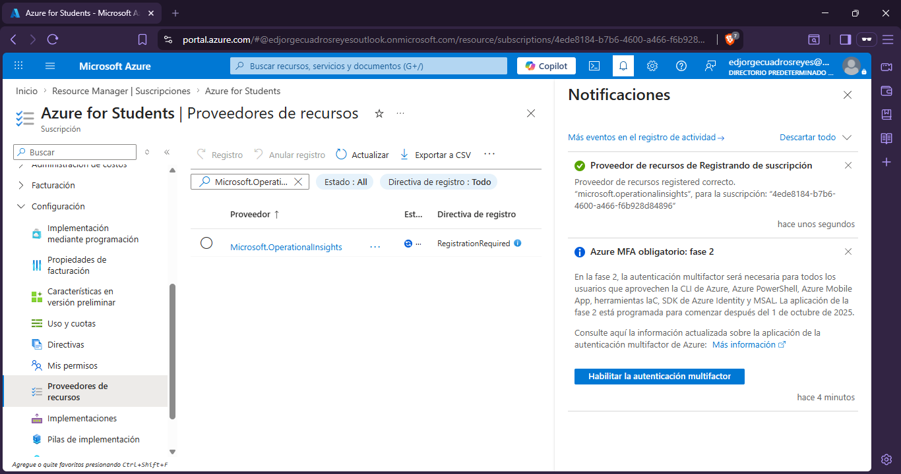
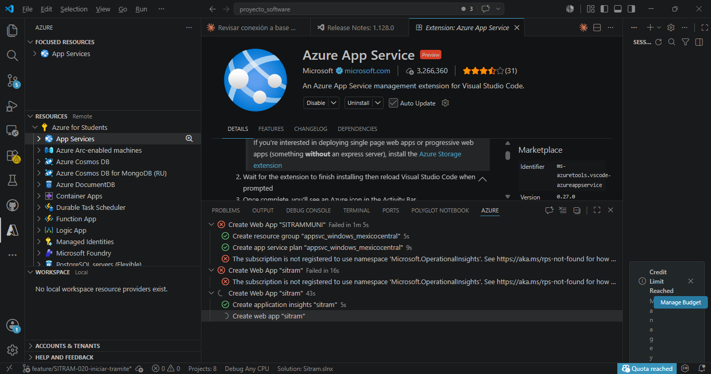
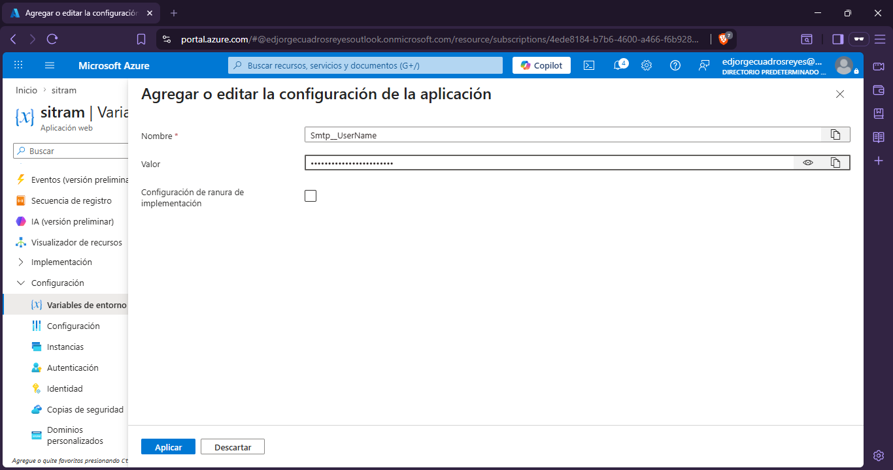
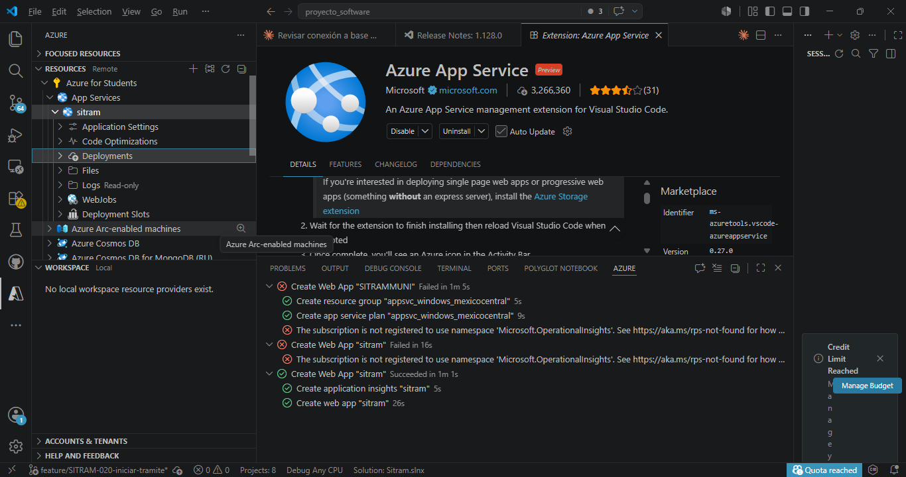
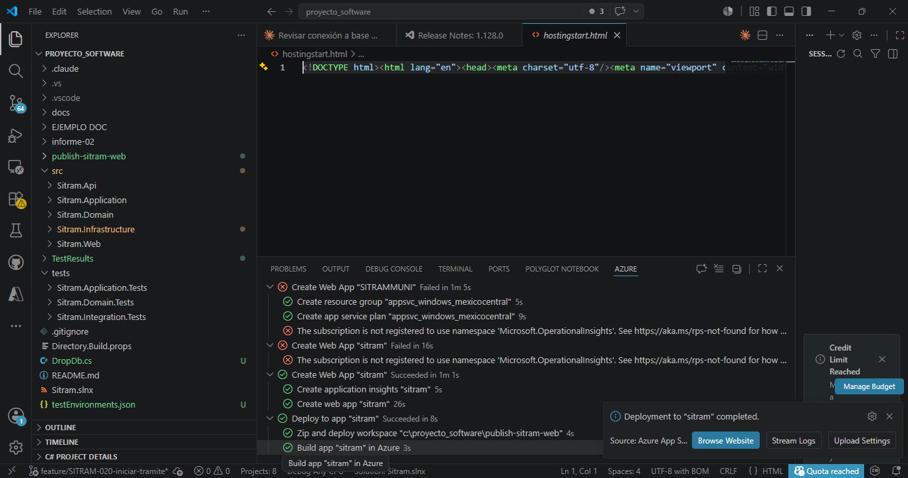
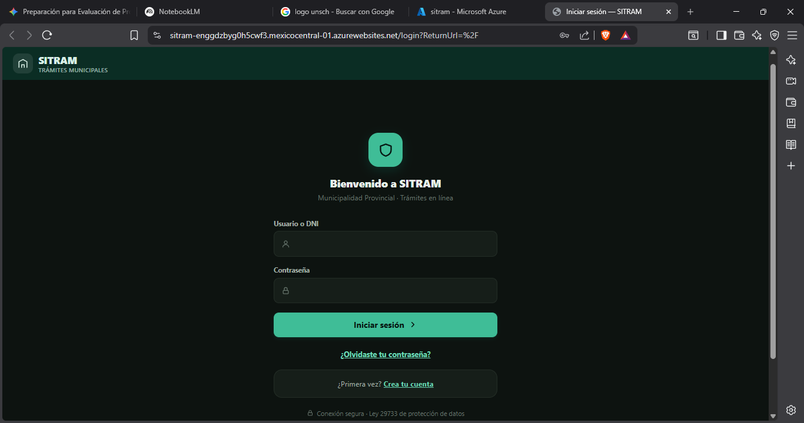

# Anexos

## Anexo 1. Matriz de Consistencia

Se presenta en el documento de Matriz de Consistencia (incluido en este informe), que articula
problema, objetivos, variables, indicadores y metodología en una sola vista.

---

## Anexo 2. Instrumentos de recolección de datos

### 2.1 Ficha de análisis documental (Variables X1 y X2)

| N.° | Elemento a verificar | Existe / Opera | Observación |
|-----|----------------------|----------------|-------------|
| 1 | Documento de requisitos (RF y RNF) | ☐ Sí ☐ No | |
| 2 | Diagrama de arquitectura | ☐ Sí ☐ No | |
| 3 | Diagrama Entidad-Relación | ☐ Sí ☐ No | |
| 4 | Registros de decisiones (ADR) | ☐ Sí ☐ No | |
| 5 | Código fuente por módulo | ☐ Sí ☐ No | |
| 6 | Reporte de cobertura de pruebas | ☐ Sí ☐ No | |
| 7 | Módulo de autenticación operativo | ☐ Sí ☐ No | |
| 8 | Módulo de autorización (RBAC) operativo | ☐ Sí ☐ No | |
| 9 | Cifrado de datos personales operativo | ☐ Sí ☐ No | |
| 10 | Flujo del trámite operativo | ☐ Sí ☐ No | |
| 11 | Registro de auditoría operativo | ☐ Sí ☐ No | |

### 2.2 Checklist de seguridad y protección de datos (Variable X3)

Escala: **C** = Cumple · **NC** = No cumple · **NA** = No aplica.

| N.° | Control | Fuente | C / NC / NA |
|-----|---------|--------|-------------|
| 1 | Comunicación cifrada con TLS 1.3 | OWASP / RNF-001 | ☐ |
| 2 | Cifrado en reposo (TDE) | RNF-004 | ☐ |
| 3 | Contraseñas con hash (bcrypt/PBKDF2) | OWASP / RNF-002 | ☐ |
| 4 | Datos personales cifrados a nivel columna | Ley 29733 / RNF-003 | ☐ |
| 5 | Control de acceso validado en servidor (RBAC) | OWASP A01 / RNF-005 | ☐ |
| 6 | Sin datos personales en logs | Ley 29733 / RNF-010 | ☐ |
| 7 | Errores sin exponer detalles internos | OWASP / RNF-006 | ☐ |
| 8 | Tokens de vida corta y refresh rotativo | RNF-008 | ☐ |
| 9 | Registro de consentimiento del titular | Ley 29733 / RF-063 | ☐ |
| 10 | Derechos ARCO + portabilidad | Ley 29733 / RF-060…064 | ☐ |
| 11 | Notificación de incidentes de seguridad | D.S. 016-2024-JUS / RF-065 | ☐ |
| 12 | Oficial de Datos Personales designado | D.S. 016-2024-JUS / RF-066 | ☐ |
| 13 | Minimización de datos | Ley 29733 / RNF-011 | ☐ |
| 14 | Auditoría inmutable de acciones | RF-070, RF-073 | ☐ |

### 2.3 Cuestionario de Usabilidad del Sistema (SUS) — Variable X4

Escala Likert de 5 puntos: 1 = Totalmente en desacuerdo … 5 = Totalmente de acuerdo.

| N.° | Ítem |
|-----|------|
| 1 | Creo que me gustaría usar este sistema con frecuencia. |
| 2 | Encontré el sistema innecesariamente complejo. |
| 3 | Pensé que el sistema era fácil de usar. |
| 4 | Creo que necesitaría el apoyo de un técnico para poder usar este sistema. |
| 5 | Encontré que las diversas funciones del sistema estaban bien integradas. |
| 6 | Pensé que había demasiada inconsistencia en el sistema. |
| 7 | Imagino que la mayoría de las personas aprenderían a usar este sistema rápidamente. |
| 8 | Encontré el sistema muy engorroso de usar. |
| 9 | Me sentí muy seguro al usar el sistema. |
| 10 | Necesité aprender muchas cosas antes de poder empezar a usar el sistema. |

> **Cálculo del puntaje SUS.** Para los ítems impares se resta 1 al valor marcado; para los
> ítems pares se resta el valor marcado a 5. Se suman las 10 contribuciones y el total se
> multiplica por 2,5, obteniendo un puntaje en el rango de 0 a 100.

---

## Anexo 3. Formato de validación por juicio de expertos

Cada experto evalúa cada ítem del instrumento en tres criterios (escala 1–4):

| Criterio | Descripción |
|----------|-------------|
| **Claridad** | El ítem se comprende fácilmente; su redacción es precisa. |
| **Coherencia** | El ítem tiene relación lógica con la dimensión que mide. |
| **Relevancia** | El ítem es esencial y debe ser incluido. |

**Datos del experto:** nombre completo, grado académico, especialidad, institución, años de
experiencia y firma. **Cálculo:** Coeficiente V de Aiken por ítem y global (criterio de
aceptación V ≥ 0,80). Se adjuntan las constancias de validación firmadas por cada experto.

---

## Anexo 4. Historias de usuario del Product Backlog

Formato: *Como [rol], quiero [acción], para [beneficio]*. Se presenta el backlog completo,
trazado a los requisitos funcionales.

### 4.1 Módulo de gestión de identidad y acceso

| ID | Historia de usuario | Prioridad | RF |
|----|---------------------|-----------|-----|
| HU-01 | Como ciudadano, quiero registrarme con verificación de correo, para acceder de forma segura. | Alta | RF-001 |
| HU-02 | Como usuario, quiero iniciar sesión con mis credenciales, para acceder a mis funciones. | Alta | RF-002 |
| HU-03 | Como sistema, quiero bloquear la cuenta tras 5 intentos fallidos, para prevenir ataques. | Alta | RF-003 |
| HU-04 | Como ciudadano, quiero recuperar mi contraseña por correo, para no perder el acceso. | Alta | RF-004 |
| HU-05 | Como funcionario, quiero autenticarme con segundo factor (MFA), para proteger mi cuenta. | Media | RF-005 |
| HU-06 | Como administrador, quiero gestionar cuentas de funcionario y sus roles, para controlar el acceso. | Alta | RF-006 |

### 4.2 Módulo de configuración de trámites (TUPA)

| ID | Historia de usuario | Prioridad | RF |
|----|---------------------|-----------|-----|
| HU-07 | Como administrador, quiero crear un tipo de trámite con su tasa y área, para publicarlo. | Alta | RF-010 |
| HU-08 | Como administrador, quiero definir los documentos requeridos por trámite, para exigirlos. | Alta | RF-011 |
| HU-09 | Como administrador, quiero definir el flujo de aprobación por trámite, para enrutar el expediente. | Alta | RF-012 |
| HU-10 | Como administrador, quiero activar o desactivar un tipo de trámite, para gestionarlo sin borrarlo. | Media | RF-013 |
| HU-11 | Como ciudadano, quiero ver el catálogo de trámites con requisitos y costos, para saber qué necesito. | Alta | RF-014 |

### 4.3 Módulo de ciclo de vida del trámite

| ID | Historia de usuario | Prioridad | RF |
|----|---------------------|-----------|-----|
| HU-12 | Como ciudadano, quiero iniciar un trámite completando un formulario, para solicitar el servicio. | Alta | RF-020 |
| HU-13 | Como ciudadano, quiero adjuntar documentos a mi expediente, para cumplir los requisitos. | Alta | RF-021 |
| HU-14 | Como ciudadano, quiero guardar un trámite como borrador, para retomarlo después. | Media | RF-022 |
| HU-15 | Como ciudadano, quiero enviar mi trámite, para que ingrese al flujo de atención. | Alta | RF-023 |
| HU-16 | Como mesa de partes, quiero verificar la admisibilidad, para aceptar o rechazar la recepción. | Alta | RF-024 |
| HU-17 | Como revisor, quiero evaluar el expediente, para registrar el resultado técnico. | Alta | RF-025 |
| HU-18 | Como revisor, quiero observar un trámite indicando qué subsanar, para que el ciudadano corrija. | Alta | RF-026 |
| HU-19 | Como ciudadano, quiero subsanar una observación y reenviar, para continuar el trámite. | Alta | RF-027 |
| HU-20 | Como jefe de área, quiero aprobar o rechazar el trámite, para emitir la resolución. | Alta | RF-028 |
| HU-21 | Como sistema, quiero impedir transiciones de estado inválidas, para mantener la integridad. | Alta | RF-029 |
| HU-22 | Como sistema, quiero generar el documento resultante al aprobar, para entregar la constancia. | Media | RF-030 |

### 4.4 Módulo de pagos

| ID | Historia de usuario | Prioridad | RF |
|----|---------------------|-----------|-----|
| HU-23 | Como sistema, quiero calcular la tasa del trámite, para informar el monto a pagar. | Alta | RF-040 |
| HU-24 | Como ciudadano, quiero registrar el pago de la tasa, para completar mi solicitud. | Alta | RF-041 |
| HU-25 | Como sistema, quiero confirmar pago y cambio de estado de forma atómica, para evitar inconsistencias. | Alta | RF-042 |
| HU-26 | Como sistema, quiero impedir el avance de un trámite impago, para asegurar el cobro. | Alta | RF-043 |
| HU-27 | Como ciudadano, quiero descargar mi comprobante de pago, para tener constancia. | Media | RF-044 |

### 4.5 Módulo de seguimiento y notificaciones

| ID | Historia de usuario | Prioridad | RF |
|----|---------------------|-----------|-----|
| HU-28 | Como ciudadano, quiero consultar el estado de mis trámites en tiempo real, para conocer su avance. | Alta | RF-050 |
| HU-29 | Como sistema, quiero notificar por correo cada cambio de estado, para mantener informado al ciudadano. | Alta | RF-051 |
| HU-30 | Como ciudadano, quiero ver el historial de actuaciones de mi expediente, para tener trazabilidad. | Media | RF-052 |
| HU-31 | Como sistema, quiero alertar cuando un trámite observado esté por vencer, para evitar su caducidad. | Baja | RF-053 |

### 4.6 Módulo de protección de datos (derechos ARCO)

| ID | Historia de usuario | Prioridad | RF |
|----|---------------------|-----------|-----|
| HU-32 | Como ciudadano, quiero exportar mis datos personales, para ejercer mi derecho de acceso y portabilidad. | Alta | RF-060 |
| HU-33 | Como ciudadano, quiero rectificar mis datos personales, para mantenerlos exactos. | Alta | RF-061 |
| HU-34 | Como ciudadano, quiero solicitar la cancelación de mis datos, para ejercer el derecho al olvido. | Alta | RF-062 |
| HU-35 | Como sistema, quiero registrar el consentimiento del ciudadano, para cumplir la ley. | Alta | RF-063 |
| HU-36 | Como ciudadano, quiero revocar mi consentimiento, para ejercer mi derecho de oposición. | Media | RF-064 |
| HU-37 | Como oficial de datos, quiero recibir la notificación de incidentes, para gestionarlos conforme a ley. | Alta | RF-065 |
| HU-38 | Como administrador, quiero designar un Oficial de Datos Personales, para cumplir la normativa. | Media | RF-066 |

### 4.7 Módulo de auditoría y reportes

| ID | Historia de usuario | Prioridad | RF |
|----|---------------------|-----------|-----|
| HU-39 | Como sistema, quiero registrar en auditoría toda acción sobre un trámite, para garantizar trazabilidad. | Alta | RF-070 |
| HU-40 | Como auditor, quiero consultar y filtrar el registro de auditoría, para fiscalizar. | Alta | RF-071 |
| HU-41 | Como jefe de área, quiero generar reportes por estado, tipo y periodo, para tomar decisiones. | Media | RF-072 |
| HU-42 | Como sistema, quiero que el registro de auditoría sea inmutable, para su valor probatorio. | Alta | RF-073 |

---

## Anexo 5. Casos de uso detallados

### 5.1 Caso de uso: Iniciar trámite

- **Actor principal:** Ciudadano.
- **Precondiciones:** el ciudadano está autenticado; existe al menos un tipo de trámite activo.
- **Flujo principal:**
  1. El ciudadano selecciona un tipo de trámite del catálogo.
  2. El sistema muestra los requisitos y la tasa.
  3. El ciudadano completa el formulario y adjunta los documentos requeridos.
  4. El ciudadano envía la solicitud.
  5. El sistema valida los datos, crea el expediente en estado `Recibido` y registra el evento
     de auditoría.
  6. El sistema notifica al ciudadano por correo.
- **Flujos alternativos:** si faltan documentos obligatorios, el sistema informa y no permite el
  envío; el ciudadano puede guardar como borrador (RF-022).
- **Postcondiciones:** el expediente queda registrado y visible en el seguimiento del ciudadano.

### 5.2 Caso de uso: Aprobar o rechazar trámite

- **Actor principal:** Jefe de Área.
- **Precondiciones:** el trámite está en estado `EnRevision`; el funcionario tiene el permiso
  `tramite:aprobar`.
- **Flujo principal:**
  1. El jefe de área abre el expediente asignado a su área.
  2. Revisa la evaluación del revisor y la documentación.
  3. Registra la decisión (aprobar o rechazar) con un comentario.
  4. El sistema valida la transición de estado, emite la resolución y registra la auditoría.
  5. El sistema notifica al ciudadano.
- **Flujos alternativos:** si la transición es inválida, el sistema la rechaza (RF-029).
- **Postcondiciones:** el trámite queda `Aprobado` o `Rechazado` con su resolución.

### 5.3 Caso de uso: Registrar pago

- **Actor principal:** Ciudadano.
- **Precondiciones:** el trámite requiere pago de tasa y está pendiente de pago.
- **Flujo principal:**
  1. El ciudadano selecciona la opción de pago.
  2. El sistema calcula la tasa y redirige a la pasarela (modo prueba).
  3. La pasarela confirma el pago.
  4. El sistema, en una única transacción, marca el pago como confirmado y habilita el avance.
  5. El sistema genera el comprobante y registra la auditoría.
- **Flujos alternativos:** si el pago falla, el estado permanece pendiente y se informa al
  ciudadano.
- **Postcondiciones:** el trámite queda habilitado para continuar el flujo.

### 5.4 Caso de uso: Ejercer derecho de acceso (ARCO)

- **Actor principal:** Ciudadano.
- **Precondiciones:** el ciudadano está autenticado.
- **Flujo principal:**
  1. El ciudadano solicita la exportación de sus datos personales.
  2. El sistema recopila los datos asociados a su identidad.
  3. El sistema genera un archivo en formato interoperable y lo entrega.
  4. El sistema registra la solicitud en la auditoría.
- **Postcondiciones:** el ciudadano obtiene sus datos; queda constancia del ejercicio del
  derecho.

### 5.5 Caso de uso: Autenticación con control de acceso

- **Actor principal:** Usuario (cualquier rol).
- **Flujo principal:**
  1. El usuario ingresa sus credenciales.
  2. El sistema las valida y emite un JWT con sus *claims* de permiso.
  3. En cada petición, el middleware valida el token y la política RBAC.
  4. Si el permiso es suficiente, se ejecuta la operación; si no, se deniega (HTTP 403).
- **Flujos alternativos:** tras 5 intentos fallidos, la cuenta se bloquea (RF-003).

---

## Anexo 6. Diccionario de datos

Se describe la estructura de las principales entidades del modelo de datos. PK = clave primaria;
FK = clave foránea.

### 6.1 CIUDADANO

| Campo | Tipo | Clave | Descripción |
|-------|------|-------|-------------|
| CiudadanoId | uniqueidentifier | PK | Identificador único del ciudadano |
| Nombres | nvarchar(100) | | Nombres del ciudadano |
| Apellidos | nvarchar(100) | | Apellidos del ciudadano |
| Dni | varbinary | | DNI cifrado (determinista) |
| Telefono | varbinary | | Teléfono cifrado (aleatorio) |
| Correo | varbinary | | Correo cifrado (determinista) |
| Direccion | nvarchar(200) | | Dirección (protegida por TDE) |
| EstaAnonimizado | bit | | Indicador de derecho al olvido |
| CreadoUtc | datetime2 | | Fecha de registro (UTC) |

### 6.2 USUARIO

| Campo | Tipo | Clave | Descripción |
|-------|------|-------|-------------|
| UsuarioId | uniqueidentifier | PK | Identificador del usuario |
| UserName | nvarchar(100) | | Nombre de usuario |
| PasswordHash | nvarchar(256) | | Contraseña con hash (bcrypt/PBKDF2) |
| MfaHabilitado | bit | | Indicador de segundo factor |
| IntentosFallidos | int | | Contador de intentos fallidos |
| Bloqueado | bit | | Estado de bloqueo de la cuenta |
| CreadoUtc | datetime2 | | Fecha de creación (UTC) |

### 6.3 ROL, PERMISO y tablas de relación

| Entidad | Campo | Tipo | Clave | Descripción |
|---------|-------|------|-------|-------------|
| ROL | RolId | int | PK | Identificador del rol |
| ROL | Nombre | nvarchar(50) | | Nombre del rol |
| PERMISO | PermisoId | int | PK | Identificador del permiso |
| PERMISO | Codigo | nvarchar(50) | | Código (p. ej. `tramite:aprobar`) |
| USUARIO_ROL | UsuarioId | uniqueidentifier | FK | Usuario asociado |
| USUARIO_ROL | RolId | int | FK | Rol asignado |
| ROL_PERMISO | RolId | int | FK | Rol asociado |
| ROL_PERMISO | PermisoId | int | FK | Permiso incluido |

### 6.4 TIPO_TRAMITE, REQUISITO_DOCUMENTO y PASO_FLUJO

| Entidad | Campo | Tipo | Clave | Descripción |
|---------|-------|------|-------|-------------|
| TIPO_TRAMITE | TipoTramiteId | int | PK | Identificador del tipo de trámite |
| TIPO_TRAMITE | Nombre | nvarchar(150) | | Nombre del trámite |
| TIPO_TRAMITE | Descripcion | nvarchar(500) | | Descripción |
| TIPO_TRAMITE | AreaResponsable | nvarchar(100) | | Área que lo atiende |
| TIPO_TRAMITE | Tasa | decimal(10,2) | | Costo del trámite |
| TIPO_TRAMITE | Activo | bit | | Borrado lógico |
| REQUISITO_DOCUMENTO | RequisitoId | int | PK | Identificador del requisito |
| REQUISITO_DOCUMENTO | TipoTramiteId | int | FK | Tipo de trámite al que pertenece |
| REQUISITO_DOCUMENTO | Nombre | nvarchar(150) | | Documento requerido |
| REQUISITO_DOCUMENTO | Obligatorio | bit | | Si es obligatorio |
| PASO_FLUJO | PasoId | int | PK | Identificador del paso |
| PASO_FLUJO | TipoTramiteId | int | FK | Tipo de trámite |
| PASO_FLUJO | Orden | int | | Orden del paso en el flujo |
| PASO_FLUJO | RolResponsableId | int | FK | Rol responsable del paso |

### 6.5 TRAMITE

| Campo | Tipo | Clave | Descripción |
|-------|------|-------|-------------|
| TramiteId | uniqueidentifier | PK | Identificador del expediente |
| CiudadanoId | uniqueidentifier | FK | Ciudadano solicitante |
| TipoTramiteId | int | FK | Tipo de trámite |
| Estado | nvarchar(20) | | Estado de la máquina de estados |
| Codigo | nvarchar(30) | | Código público correlativo |
| CreadoUtc | datetime2 | | Fecha de creación (UTC) |
| RowVersion | rowversion | | Control de concurrencia optimista |

### 6.6 DOCUMENTO, PAGO, ACTUACION y RESOLUCION

| Entidad | Campo | Tipo | Clave | Descripción |
|---------|-------|------|-------|-------------|
| DOCUMENTO | DocumentoId | uniqueidentifier | PK | Identificador del documento |
| DOCUMENTO | TramiteId | uniqueidentifier | FK | Trámite asociado |
| DOCUMENTO | NombreArchivo | nvarchar(200) | | Nombre del archivo |
| DOCUMENTO | RutaAlmacenamiento | nvarchar(300) | | Ruta de almacenamiento |
| DOCUMENTO | HashSha256 | nvarchar(64) | | Hash de integridad |
| DOCUMENTO | SubidoUtc | datetime2 | | Fecha de subida (UTC) |
| PAGO | PagoId | uniqueidentifier | PK | Identificador del pago |
| PAGO | TramiteId | uniqueidentifier | FK | Trámite asociado |
| PAGO | Monto | decimal(10,2) | | Monto pagado |
| PAGO | Estado | nvarchar(20) | | Pendiente/Confirmado/Fallido |
| PAGO | ReferenciaPasarela | nvarchar(100) | | Referencia de la pasarela |
| PAGO | FechaUtc | datetime2 | | Fecha del pago (UTC) |
| ACTUACION | ActuacionId | uniqueidentifier | PK | Identificador de la actuación |
| ACTUACION | TramiteId | uniqueidentifier | FK | Trámite asociado |
| ACTUACION | EstadoAnterior | nvarchar(20) | | Estado previo |
| ACTUACION | EstadoNuevo | nvarchar(20) | | Estado resultante |
| ACTUACION | Comentario | nvarchar(500) | | Comentario de la actuación |
| ACTUACION | FechaUtc | datetime2 | | Fecha (UTC) |
| RESOLUCION | ResolucionId | uniqueidentifier | PK | Identificador de la resolución |
| RESOLUCION | TramiteId | uniqueidentifier | FK | Trámite asociado |
| RESOLUCION | Sentido | nvarchar(20) | | Aprobado/Rechazado |
| RESOLUCION | RutaDocumento | nvarchar(300) | | Ruta del documento emitido |
| RESOLUCION | EmitidaUtc | datetime2 | | Fecha de emisión (UTC) |

### 6.7 CONSENTIMIENTO, EVENTO_AUDITORIA e INCIDENTE_SEGURIDAD

| Entidad | Campo | Tipo | Clave | Descripción |
|---------|-------|------|-------|-------------|
| CONSENTIMIENTO | ConsentimientoId | uniqueidentifier | PK | Identificador del consentimiento |
| CONSENTIMIENTO | CiudadanoId | uniqueidentifier | FK | Ciudadano titular |
| CONSENTIMIENTO | Finalidad | nvarchar(200) | | Finalidad del tratamiento |
| CONSENTIMIENTO | Otorgado | bit | | Si fue otorgado |
| CONSENTIMIENTO | FechaUtc | datetime2 | | Fecha de otorgamiento (UTC) |
| CONSENTIMIENTO | RevocadoUtc | datetime2 | | Fecha de revocación (UTC) |
| EVENTO_AUDITORIA | EventoId | bigint | PK | Identificador del evento |
| EVENTO_AUDITORIA | TramiteId | uniqueidentifier | FK | Trámite asociado |
| EVENTO_AUDITORIA | UsuarioId | uniqueidentifier | FK | Usuario que ejecutó la acción |
| EVENTO_AUDITORIA | Accion | nvarchar(100) | | Acción realizada |
| EVENTO_AUDITORIA | DatosAntes | nvarchar(max) | | Estado previo (JSON, sin PII) |
| EVENTO_AUDITORIA | DatosDespues | nvarchar(max) | | Estado posterior (JSON, sin PII) |
| EVENTO_AUDITORIA | DireccionIp | nvarchar(45) | | IP de origen |
| EVENTO_AUDITORIA | FechaUtc | datetime2 | | Fecha del evento (UTC) |
| INCIDENTE_SEGURIDAD | IncidenteId | uniqueidentifier | PK | Identificador del incidente |
| INCIDENTE_SEGURIDAD | Descripcion | nvarchar(500) | | Descripción del incidente |
| INCIDENTE_SEGURIDAD | Severidad | nvarchar(20) | | Nivel de severidad |
| INCIDENTE_SEGURIDAD | DetectadoUtc | datetime2 | | Fecha de detección (UTC) |
| INCIDENTE_SEGURIDAD | NotificadoUtc | datetime2 | | Fecha de notificación (UTC) |
| INCIDENTE_SEGURIDAD | ReportadoPorId | uniqueidentifier | FK | Usuario que reportó |

---

## Anexo 7. Entregables de ingeniería de software

### 7.1 Diagrama de arquitectura

Se presenta la arquitectura en cuatro capas (Clean Architecture), con el pipeline de seguridad y
la vista de componentes (ver documentación de ingeniería del proyecto).

### 7.2 Diagrama Entidad-Relación (DER)

Se presenta el diagrama de las 17 entidades, con claves, índices, clasificación y cifrado de
datos personales, y la tabla de auditoría inmutable.

**Figura 5**

*Diagrama Entidad-Relación (vista resumida en torno al agregado `Tramite`)*

*Nota.* Elaboración propia. El diagrama entidad-relación completo, con todos los atributos,
claves e índices, se detalla en la documentación de ingeniería del proyecto (`docs/modelo-datos.md`).

### 7.3 Registros de Decisiones de Arquitectura (ADR)

Se presentan los siete ADR que justifican la metodología SDD, la Clean Architecture, la
elección inicial de EF Core con SQL Server y su posterior migración a PostgreSQL/Supabase, la
estrategia de seguridad conforme a la Ley 29733, el modelo de autenticación y autorización, y
la elección del frontend con Blazor.

### 7.4 Prototipos de interfaz

*(Pendiente de elaboración en la fase de construcción: pantallas de registro, catálogo de
trámites, formulario de solicitud, seguimiento de estado y bandeja del funcionario.)*

---

## Anexo 8. Evidencia de despliegue en un entorno cloud (Azure)

Como parte de la validación de la viabilidad técnica y operativa (§1.8), se documentó el
proceso de aprovisionamiento y publicación de la plataforma en un entorno cloud (Microsoft
Azure), verificando que la solución puede desplegarse fuera del entorno local de desarrollo.

**Figura 6**

*Registro del proveedor de recursos `Microsoft.OperationalInsights` en la suscripción de Azure*

*Nota.* Paso previo requerido por Azure antes de aprovisionar el recurso de sitio web.

**Figura 7**

*Creación del recurso de sitio web (App Service) en Azure*

**Figura 8**

*Configuración de los recursos de Azure asociados al despliegue*

**Figura 9**

*Publicación de la aplicación (subida del paquete) — primera etapa*

**Figura 10**

*Publicación de la aplicación (subida del paquete) — segunda etapa*

**Figura 11**

*Acceso a la URL pública provista por Azure tras la publicación*

**Figura 12**

*Sitio publicado, accesible desde la URL asignada por Azure*

*Nota.* Elaboración propia. Evidencia capturada durante la fase de aprovisionamiento cloud del
proyecto; complementa la viabilidad técnica descrita en el Capítulo I.
