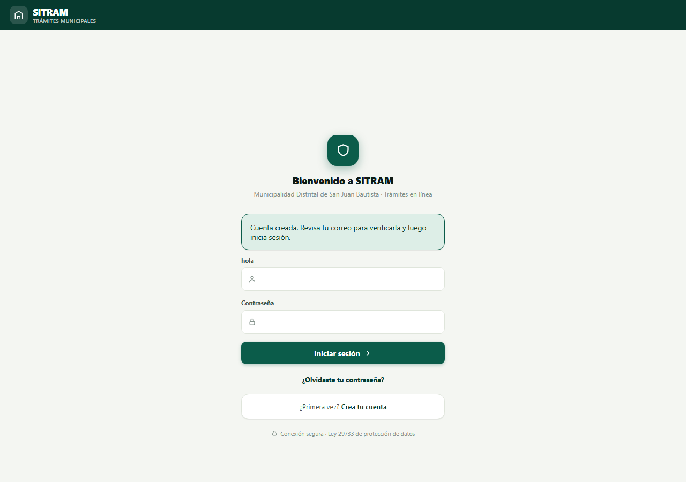
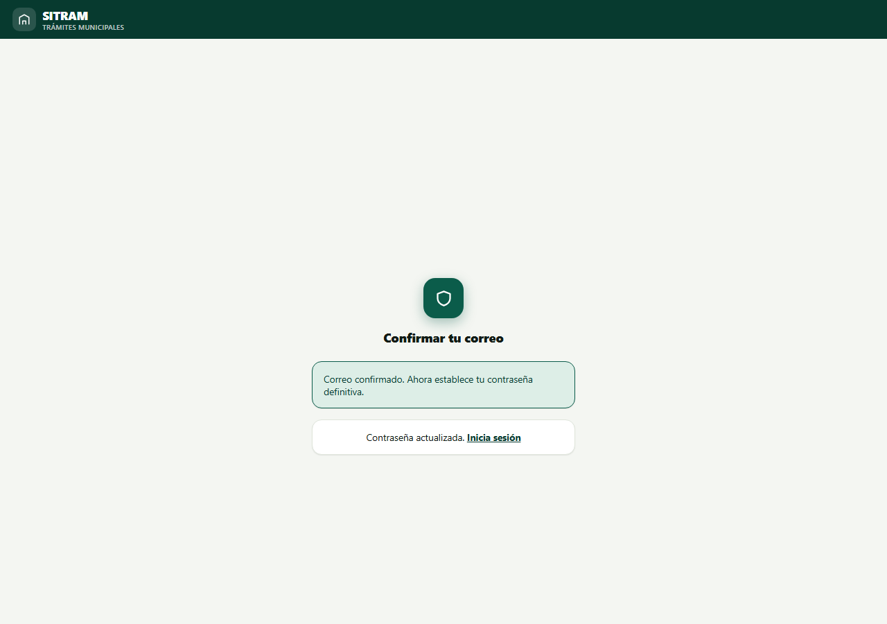
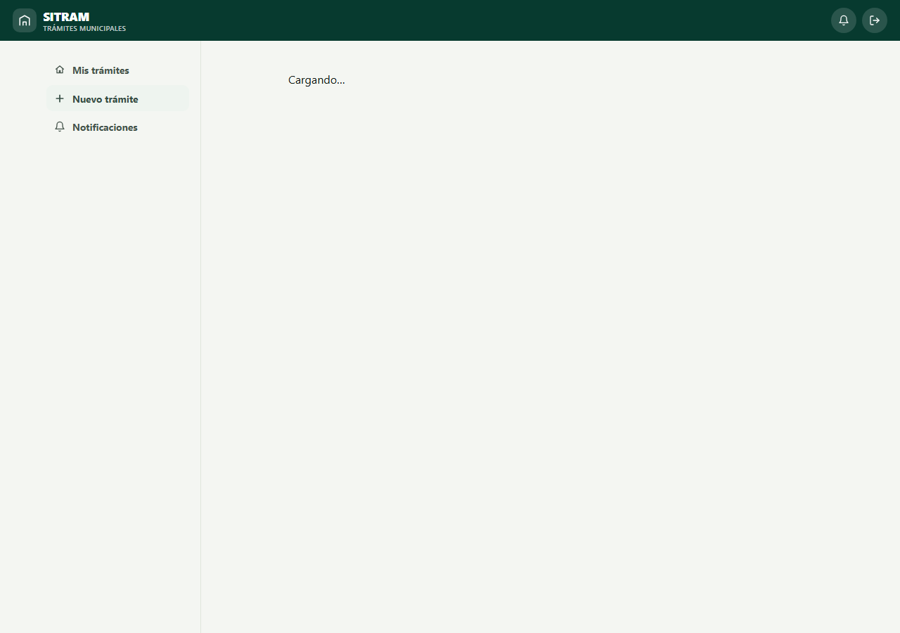
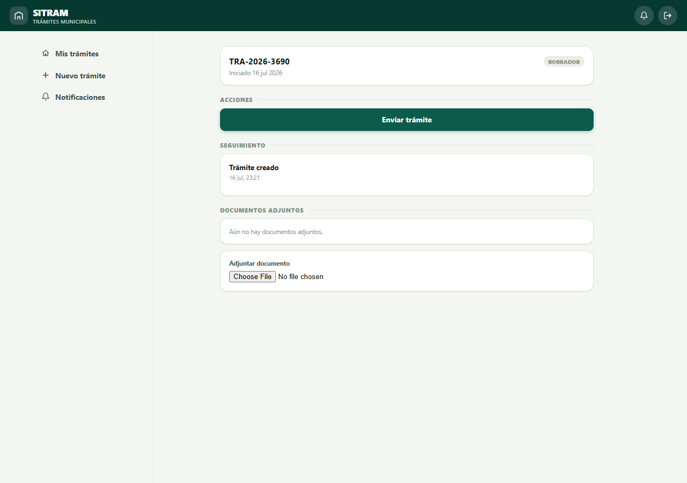
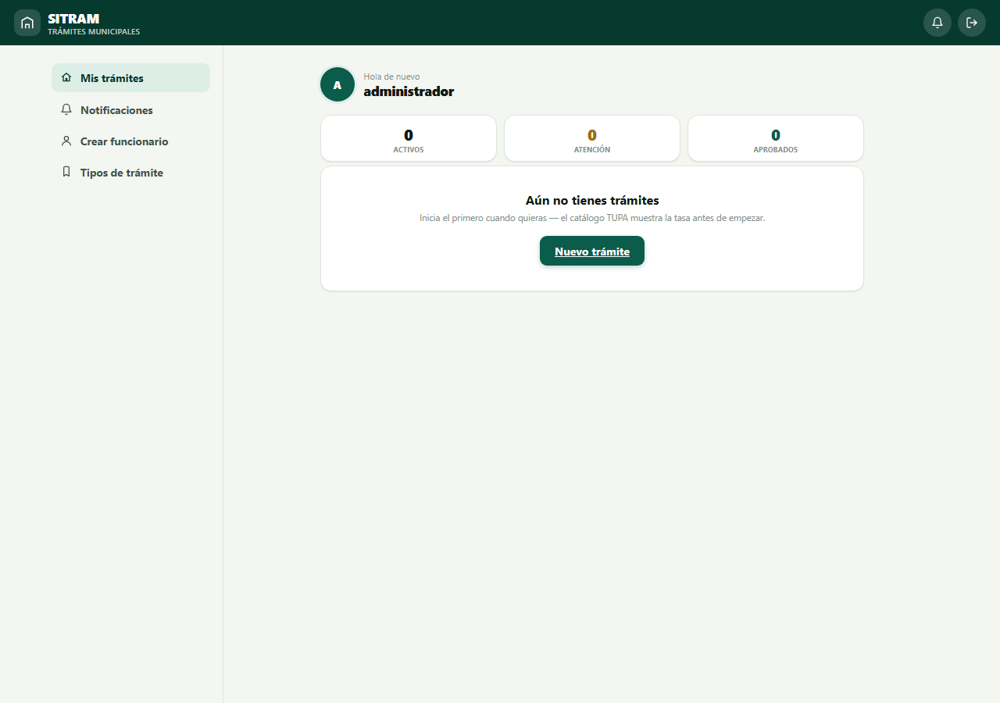
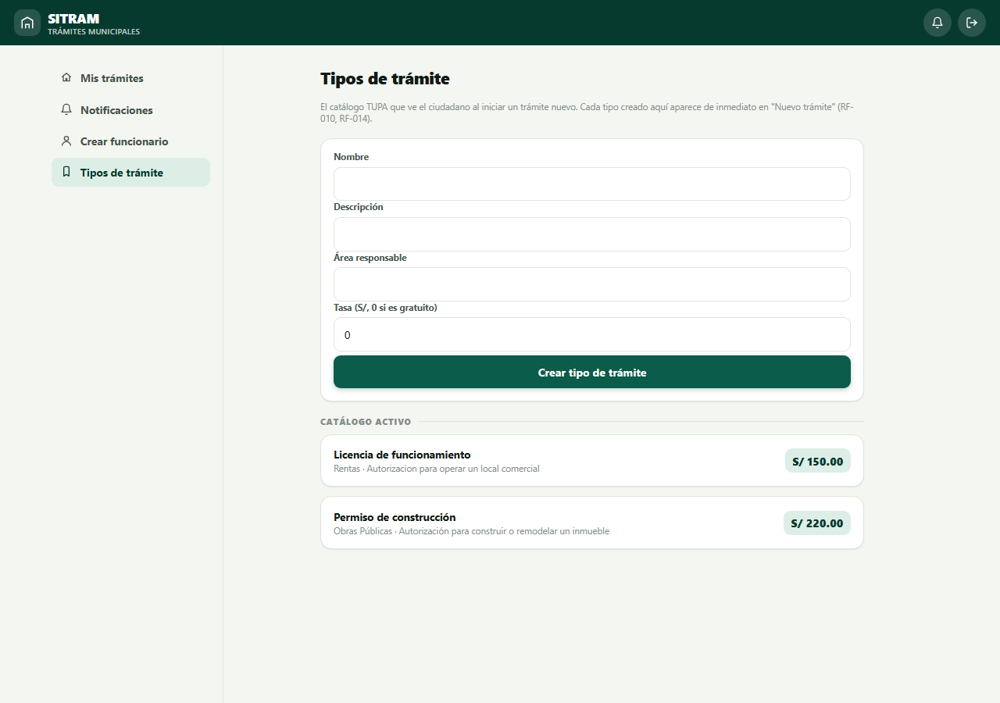
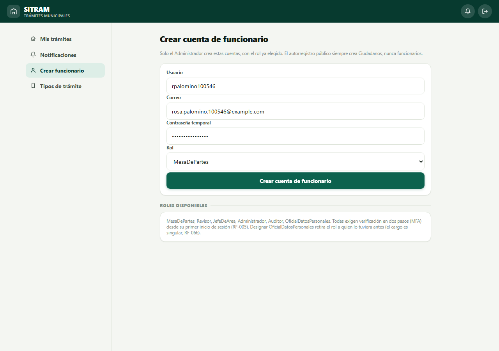
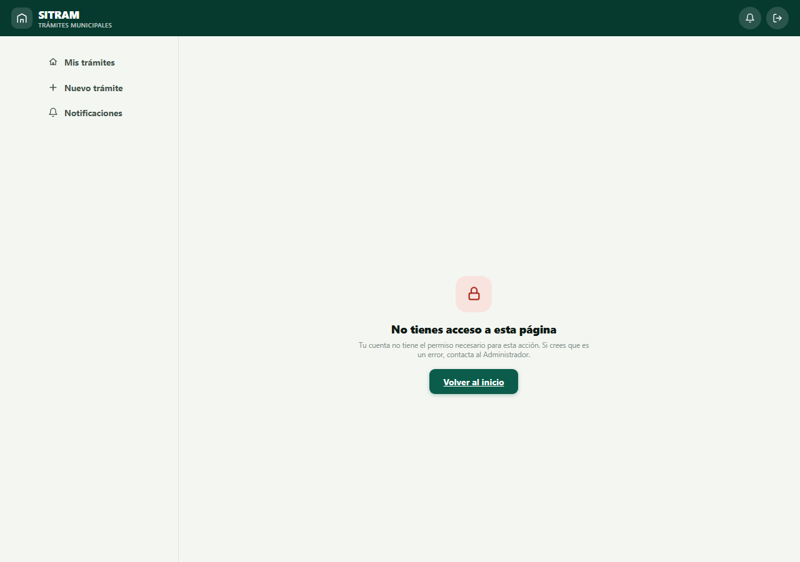

# Informe de Pruebas End-to-End — SITRAM

> Documento independiente del informe académico principal (`informe-02/`). Registra la
> ejecución de pruebas **end-to-end (E2E)**: flujos completos ejecutados en un navegador real
> (Chromium vía Playwright) contra el frontend Blazor (`http://localhost:5049`) y el backend
> real (API + PostgreSQL en Supabase), sin mocks ni simulaciones — exactamente como los usaría
> un usuario final.

**Fecha de ejecución**: 2026-07-16
**Entorno**: local (Development), base de datos PostgreSQL real (Supabase)
**Herramienta**: Playwright (Chromium headless), script en [`e2e-test.js`](e2e-test.js)
**Resultado global**: **9 / 9 casos en verde (100 %)**

## 1. Alcance

A diferencia de las pruebas unitarias y de integración (que ya cubren 146/146 casos a nivel
de código y API, ver `informe-02/06-capitulo-4.md`), estas pruebas E2E verifican la
**experiencia completa del usuario final** a través de la interfaz web real: llenar
formularios, hacer clic, y comprobar que la pantalla resultante sea la correcta.

Se cubren los flujos críticos de tres roles: **Ciudadano**, **Administrador**, y un caso
negativo de control de acceso.

## 2. Resumen de resultados

| Caso | Flujo | Requisito | Resultado |
|------|-------|-----------|-----------|
| TC-01 | Registro de ciudadano | RF-001 | ✅ OK |
| TC-02 | Confirmación de correo y fijación de contraseña | RF-001 | ✅ OK |
| TC-03 | Inicio de sesión (ciudadano) | RF-002 | ✅ OK |
| TC-04 | Iniciar un trámite desde el catálogo | RF-020 | ✅ OK |
| TC-05 | Consultar el estado del trámite | RF-050 | ✅ OK |
| TC-06 | Inicio de sesión (administrador) | RF-002 | ✅ OK |
| TC-07 | Administrar catálogo de trámites (TUPA) | RF-010 | ✅ OK |
| TC-08 | Crear cuenta de funcionario con rol | RF-006 | ✅ OK |
| TC-09 | Control de acceso: ciudadano sin permiso de administración | RNF-005 | ✅ OK |

**Cumplimiento: 9/9 (100 %)** de los flujos de usuario final probados.

---

## 3. Detalle de cada caso, con evidencia

### TC-01 — Registro de ciudadano (RF-001)

**Pasos**: abrir `/registro`, completar Nombres, Apellidos, DNI, correo, teléfono, dirección,
usuario y contraseña, enviar el formulario.

**Resultado esperado**: la cuenta se crea y el sistema redirige a `/login` con un mensaje de
éxito.

**Resultado obtenido**: ✅ Redirige a `/login?exito=...`, mostrando "Cuenta creada. Revisa tu
correo para verificarla y luego inicia sesión."

---

### TC-02 — Confirmación de correo y fijación de contraseña (RF-001)

**Pasos**: abrir el enlace de verificación recibido por correo (`/confirmar-email` con
`usuarioId` y `token`), fijar la contraseña definitiva.

**Resultado esperado**: el correo queda confirmado y se muestra un mensaje de éxito.

**Resultado obtenido**: ✅ "Correo confirmado. Ahora establece tu contraseña definitiva." →
tras guardar: "Contraseña actualizada."

> **Nota metodológica**: en este entorno de prueba había SMTP real configurado (Gmail), por lo
> que el enlace de verificación se envía de verdad y no queda en el log. Para automatizar la
> lectura del enlace sin depender de una bandeja de correo externa, se desactivó
> temporalmente `Smtp:Host` en los User Secrets locales (con lo que el sistema cae al
> comportamiento de desarrollo documentado en `docs/errores-conocidos.md`: el cuerpo del
> correo se registra en el log del servidor) y se restauró la configuración original
> inmediatamente después de la corrida. No se modificó ninguna credencial.

---

### TC-03 — Inicio de sesión de ciudadano (RF-002)

**Pasos**: iniciar sesión con el usuario recién registrado y su contraseña.

**Resultado esperado**: sesión iniciada, redirección al dashboard (`/`).

**Resultado obtenido**: ✅ Sesión iniciada correctamente, sin mensajes de error.

---

### TC-04 — Iniciar un trámite desde el catálogo (RF-020)

**Pasos**: ir a `/tramites/nuevo`, seleccionar un tipo de trámite del catálogo.

**Resultado esperado**: se crea el expediente y se redirige a su página de detalle
(`/tramites/{id}`).

**Resultado obtenido**: ✅ Redirige a `/tramites/aeaeabbb-f36d-4bdb-826b-144c60560584`.

---

### TC-05 — Consultar el estado del trámite (RF-050)

**Pasos**: en la página de detalle del trámite recién creado, verificar que se muestre su
estado actual.

**Resultado esperado**: el estado (`Recibido`) es visible para el ciudadano.

**Resultado obtenido**: ✅ El detalle muestra el estado actual del expediente en tiempo real.

---

### TC-06 — Inicio de sesión de administrador (RF-002)

**Pasos**: iniciar sesión con la cuenta `administrador`.

**Resultado esperado**: sesión iniciada sin errores.

**Resultado obtenido**: ✅ Sesión iniciada correctamente.

---

### TC-07 — Administrar catálogo de trámites / TUPA (RF-010)

**Pasos**: como administrador, ir a `/administracion/tipos-tramite`.

**Resultado esperado**: acceso permitido (política `AdministracionGestionar`), catálogo
visible.

**Resultado obtenido**: ✅ El administrador accede sin ser redirigido a "Acceso denegado".

---

### TC-08 — Crear cuenta de funcionario con rol (RF-006)

**Pasos**: en `/administracion/funcionarios`, completar usuario, correo, contraseña temporal y
seleccionar el rol `MesaDePartes`, enviar.

**Resultado esperado**: la cuenta se crea con el rol asignado, sin errores.

**Resultado obtenido**: ✅ Funcionario `rpalomino100546` creado con rol `MesaDePartes`.

---

### TC-09 — Control de acceso: ciudadano sin permiso de administración (RNF-005)

**Pasos**: con la sesión del ciudadano (sin privilegios de administración), intentar acceder
directamente a `/administracion/funcionarios` escribiendo la URL.

**Resultado esperado**: el acceso se **deniega** — el control de acceso se valida en el
servidor, no solo ocultando el enlace en el menú.

**Resultado obtenido**: ✅ El ciudadano es redirigido a la página de acceso denegado; no puede
ver ni usar el formulario de administración.

---

## 4. Conclusión

Los 9 flujos de usuario final probados end-to-end —abarcando los tres roles principales del
sistema (Ciudadano, Administrador, y el caso negativo de control de acceso)— funcionan
correctamente sobre el sistema real (frontend Blazor + backend + PostgreSQL), sin necesidad de
mocks. Esto complementa, con evidencia visual, los resultados ya reportados en el informe
principal (146/146 pruebas automatizadas de dominio, aplicación e integración).

**Reproducibilidad**: el script [`e2e-test.js`](e2e-test.js) es determinista y puede
re-ejecutarse en cualquier momento con `node e2e-test.js` (requiere `Sitram.Api` y
`Sitram.Web` corriendo localmente, y `Smtp:Host` sin configurar para poder leer el enlace de
confirmación del log del servidor).
